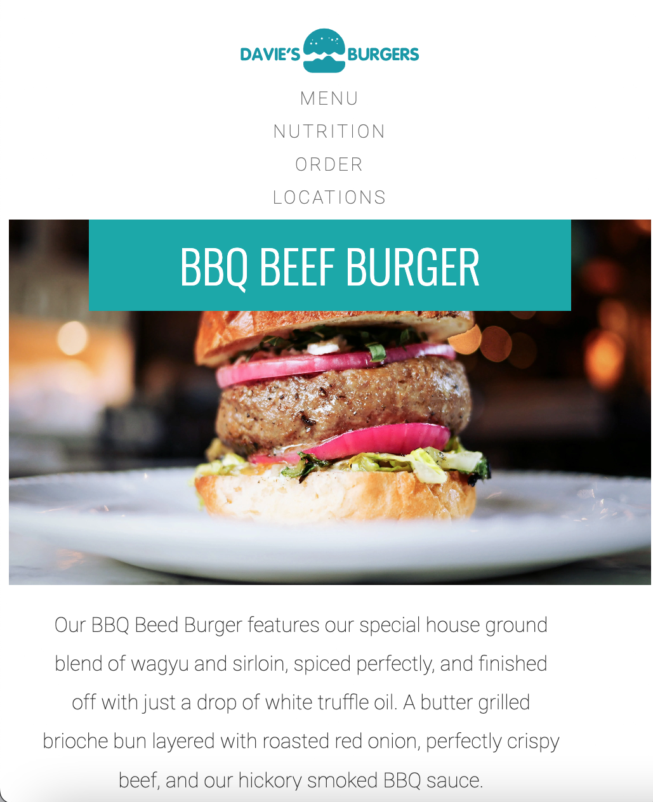

# Davie's Burgers Fast Food Restaurant

In this project, I fixed a restaurant’s website. All of the HTML and most of the CSS is intact, but the box model properties have yet to be set. Using knowledge of height, width, padding, border, and margin allowed me to complete this project.

# Link to project: <a href="https://xxhmu54.github.io/Davies-Burgers/" target="_blank">Visit Here</a>

<!--  -->

## How It's Made:

**Tech used:** HTML, CSS, JavaScript, Framework of choice

In this project, I learned about an important limitation of the default box model: box dimensions are affected by border thickness and padding. In the default box model, box dimensions are affected by border thickness and padding. The box-sizing property controls the box model used by the browser. The default value of the box-sizing property is the content box. The value for the new box model is border-box. The border-box model is not affected by border thickness or padding.

In this project, I covered the four properties of the box model: height and width, padding, borders, and margins. Understanding the box model is an important step towards learning more advanced HTML and CSS topics.

## Optimizations

- Interactive Nav
- Adding other pages
- More functionality
- Interactive Nav
- Continue refining the design

## Lessons Learned:

- The box model comprises a set of properties used to create space around and between HTML elements.
  The height and width of a content area can be set in pixels or percentages.
- Borders surround the content area and padding of an element. The colour, style, and thickness of a border can be set with CSS properties.
- Padding is the space between the content area and the border. It can be set in pixels or per cent.
- Margin is the amount of spacing outside of an element’s border.
- Horizontal margins add, so the total space between the borders of adjacent elements is equal to the sum of the right margin of one element and the left margin of the adjacent element.
- Vertical margins collapse, so the space between vertically adjacent elements is equal to the larger margin.
  margin: 0 auto horizontally centres an element inside of its parent content area if it has a width.
- The overflow property can be set to display, hidden, or scroll, and dictates how HTML will render content that overflows its parent’s content area.
- The visibility property can hide or show elements.
